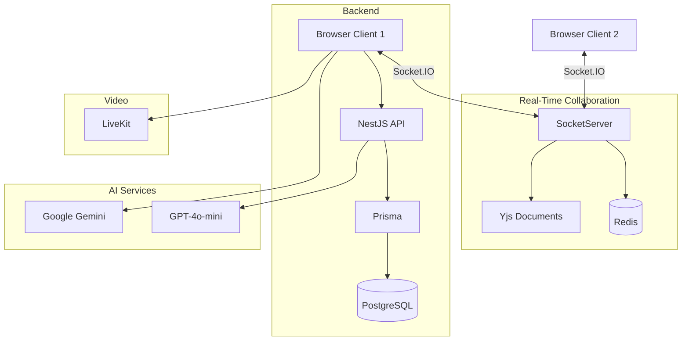

# 🧠 CollabBoard – Real-Time Collaborative AI Whiteboard

CollabBoard is a **real-time collaborative infinite whiteboard platform** designed for brainstorming, teaching, planning, and remote team collaboration. It combines smooth HTML5 canvas freehand drawing, WebRTC audio/video calls, AI assistance, Yjs conflict-free sync, and offline-first persistence into a highly robust and scalable monorepo platform.

> Built as part of a **Hackathon Project** by **Team CodeRangers** and enhanced with a production-ready **CollabBoard++** architecture.

---

# 🚀 Live Demo & Quick Deploy

- **Live App Demo:** `https://collabboard.vercel.app` *(Replace with your deployed URL)*
- **API Documentation:** `http://localhost:4000/api/docs`

---

# ✨ Features Breakdown

## 🎨 Infinite Interactive Canvas

- Smooth freehand drawing powered by HTML5 Canvas & Konva
- Rich toolbar supporting:
  - Pen
  - Rectangle
  - Circle
  - Line
  - Text
  - Brush customization
- Infinite canvas with pan & zoom
- AI-powered sketch correction using **Google Gemini**
- Drag-and-drop image support

---

## 👥 Conflict-Free Collaboration & Presence

- Yjs CRDT synchronization
- Live collaborative cursors (Figma-style)
- Presence indicators
- Dynamic private rooms using `roomId`
- Conflict-free synchronization

---

## 🎥 WebRTC Audio & Video Calling

- Built-in video & audio calls
- Powered by **LiveKit**
- Camera & microphone toggles
- Automatic room joining
- Participant synchronization

---

## 🤖 Dual AI Engine (Gemini + OpenAI)

### Google Gemini

- Canvas understanding
- OCR
- Whiteboard summaries
- Sketch recognition

### OpenAI

- Meeting summaries
- Action item generation
- Mermaid diagram generation
- Idea organization

---

## ☁️ Offline-First Architecture

- IndexedDB offline outbox
- Automatic sync on reconnect
- Google Drive snapshot sync
- Event sourcing
- Version history
- Restore previous whiteboard versions

---

## 🛡️ Security

- Firebase Authentication
- OAuth Login
- JWT Authentication
- Role Based Access Control

Roles:

- OWNER
- EDITOR
- VIEWER

---

# 🧱 Monorepo Architecture

```
collabboard/
│
├── apps/
│   └── api/
│       ├── src/
│       ├── prisma/
│       └── package.json
│
├── packages/
│   └── shared/
│
├── server/
│   └── collabplus.js
│
├── src/
│   ├── app/
│   ├── components/
│   ├── lib/
│   └── utils/
│
├── docs/
├── infra/
│
├── Dockerfile
├── docker-compose.yml
├── package.json
└── server.js
```

---

# 🛠️ Technology Stack

| Layer | Technologies |
|--------|--------------|
| Frontend | Next.js (App Router), React 19, TypeScript |
| Styling | Tailwind CSS, Lucide Icons, React Icons |
| Canvas | HTML5 Canvas, Konva, React-Konva |
| Collaboration | Yjs, Socket.IO, Y-IndexedDB |
| State Management | Zustand |
| Backend | NestJS |
| Database | PostgreSQL, Prisma |
| Authentication | Firebase Auth |
| AI | Google Gemini, OpenAI GPT-4o-mini |
| Video | LiveKit |
| Cache | Redis |
| Monitoring | Prometheus, Grafana |
| DevOps | Docker, GitHub Actions |

---

# 🧬 System Architecture



---

# ⚡ Setup & Installation

## 1. Clone Repository

```bash
git clone https://github.com/your-username/collab_board.git

cd collab_board/Collab_Board
```

---

## 2. Configure Environment Variables

Create `.env.local`

```env
# Firebase Configuration
NEXT_PUBLIC_FIREBASE_API_KEY=your_firebase_api_key
NEXT_PUBLIC_FIREBASE_AUTH_DOMAIN=your_firebase_auth_domain

# LiveKit SFU (Video/Audio Calls)
LIVEKIT_API_KEY=your_livekit_api_key
LIVEKIT_API_SECRET=your_livekit_api_secret
LIVEKIT_URL=wss://your-project.livekit.cloud

# AI Services
GEMINI_API_KEY=your_gemini_api_key
OPENAI_API_KEY=your_openai_api_key
OPENAI_MODEL=gpt-4o-mini

```

---

## 3. Start Infrastructure

```bash
npm run docker:up
```

---

## 4. Install Dependencies

```bash
npm install
```

---

## 5. Initialize Database

```bash
npm run prisma:push

npm run prisma:generate
```

---

## 6. Run Application

Frontend

```bash
npm run dev
```

Backend

```bash
npm run dev:api
```

---

# 📈 Monitoring

Prometheus

```
http://localhost:9090
```

Grafana

```
http://localhost:3001

Username: admin

Password: admin
```

---

# 🧪 Testing Collaboration

1. Start both servers.
2. Open:

```
http://localhost:3000
```

3. Create a room.

4. Open the room in another browser.

5. Join video call.

6. Draw simultaneously.

7. Observe:

- Real-time drawing
- Live cursors
- Presence
- Audio/video synchronization

---

# 🔮 Future Enhancements

- Screen Sharing
- SVG Export
- PDF Export
- Speech-to-Text
- Sticky Notes
- Flowchart Connectors
- Shape Grouping
- AI Meeting Minutes
- Advanced Whiteboard Templates

---

# 📜 License

This project is released for educational and hackathon purposes.

Feel free to fork, modify, and extend it.

---

# 🙌 Acknowledgements

- LiveKit
- Yjs
- Google Gemini
- OpenAI
- Firebase
- Prisma
- PostgreSQL
- Next.js
- React
- NestJS
